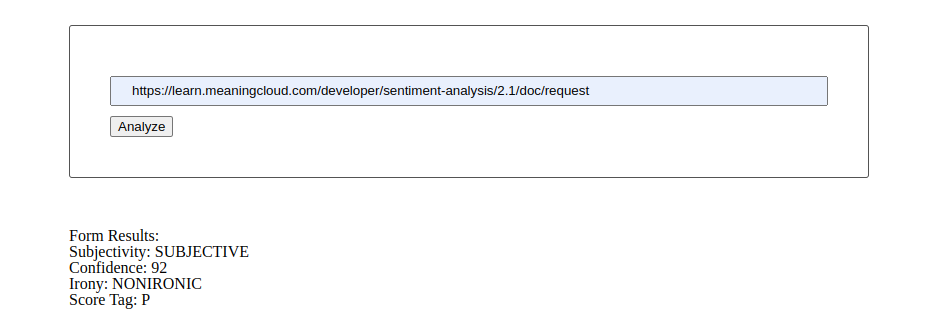

# Project 4: Evaluate a News Article with Natural Language Processing

## Overview

This project is part of Udacity's Nanodegree in Front End Development. According to the course:
> You must create a web tool that allows users to run Natural Language Processing (NLP) on articles or blogs found on other websites for this project.

The goal of this project is to become accustomed to:
- Setting up Webpack.
- Sass styles.
- Webpack Loaders and Plugins.
- Creating layouts and page design.
- Service workers.
- Using APIs and creating requests to external urls.

In addition to analyzing news articles and blogs via URLs, users in my project can also enter their own text to analyze.

## Preview



## Instructions
### Setting up the Project :computer:
Clone or download the zip file locally after forking the project's Github repo. Navigate to the project directory to install all dependencies once you have the project locally.
```
cd <project directory>
npm install
```

### Signup for an API key :key:
First, you will need to go [here](https://www.meaningcloud.com/developer/) and register for an account. Signing up will get you an API key.

Make a new file called `.env` in the project's root directory. Insert the following line into the file, replacing the stars with your personal API key.
`API_KEY=***************`

### After setup :fire:

You're ready to use it once you've created a local copy and added your API key to the `.env` file.

Start the developer server with the following command. This should open a new browser window with the app running on `localhost:8080.` ```
npm run dev | to run the express server
npm run build-dev
```
To run the production server (with express), run these commands
```
npm run build-prod
npm run start
```

For more information on the results of the text analysis, check out the [MeaningCloud API documentation](https://www.meaningcloud.com/developer/sentiment-analysis/doc/2.1/response).
